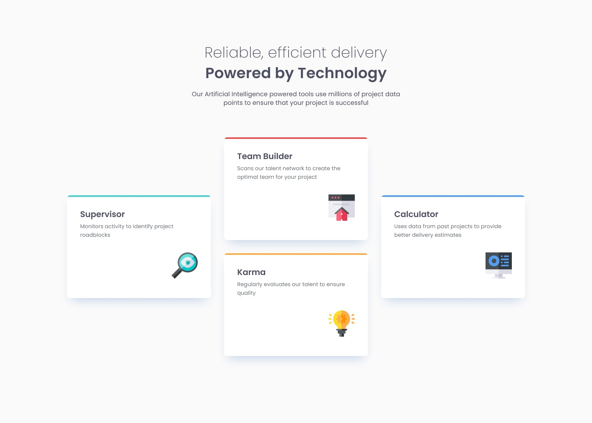

# Frontend Mentor - Four card feature section solution PT/EN

## Conteúdo | Content

- [Overview](#overview)
  - [Desafio | Challenge](#desafio--challenge)
  - [Screenshot](#screenshot)
  - [Links](#links)
- [Processo | Process](#processo--process)
  - [Feito utilizando | Built with](#feito-utilizando--built-with)
- [Autor | Author](#autor--author)

## Overview

Este é o resultado do desafio [Four card feature](https://www.frontendmentor.io/challenges/four-card-feature-section-weK1eFYK) do frontend mentor.

This is the result of the [Four card feature](https://www.frontendmentor.io/challenges/four-card-feature-section-weK1eFYK) challenge from frontend mentor.

### Desafio | Challenge

Os usuários devem | Users must:

- Veja o layout ideal do site dependendo do tamanho da tela do seu dispositivo.

- View the optimal layout for the site depending on their device's screen size.

### Screenshot

### Links

- Solução | Solution: [GitHub Repo](https://github.com/lucasfs022/Four-Card-Feature)
- Live Site URL: [GitHub live site](https://lucasfs022.github.io/Four-Card-Feature/)

## Processo | Process

### Feito utilizando | Built With

- HTML5 semântico | Semantic HTML5;
- CSS3;

## Autor | Author

- Linkedin - [Lucas Silva](https://www.linkedin.com/in/lucas-silva-658980161)
